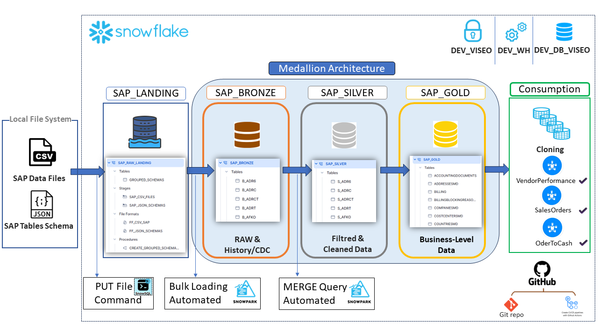

# SAP Data Acceleration Framework for Snowflake

## Introduction
The SAP Data Acceleration Framework for Snowflake is designed to accelerate the time to value of SAP data by efficiently integrating it into Snowflake. This framework facilitates the seamless migration and transformation of SAP data, making it readily accessible for advanced analytics and business intelligence activities. By leveraging a Medallion architecture, this proof of concept (POC) not only enhances the speed but also the flexibility of data handling, catering to diverse analytical needs.

## Features
Key features of the SAP Data Acceleration Framework include:
- **Automated Data Integration**: Uses Fivetran to automate the extraction and loading of SAP JSON schema and CSV data into Snowflake.
- **Medallion Architecture Implementation**: Structured data transformation across three layers—Bronze, Silver, and Gold—optimizing for different stages of data refinement and usage.
- **Snowpark for Data Processing**: Utilizes Snowpark Python scripts to manipulate and process data directly within Snowflake, leveraging native functions for enhanced performance and scalability.
- **Stored Procedures for Data Aggregation**: Aggregates multiple schema tables into a single comprehensive table, facilitating easier management and accessibility.
- **Automated Table Structure Creation**: Dynamically creates SAP table structures in Snowflake using metadata from SAP JSON schemas.
- **File Format Optimization for Bulk Loading**: Custom file formats and staging techniques ensure efficient data loading from SAP CSV files.

## Architecture
The architecture of the framework is built around Snowflake's powerful cloud data platform capabilities and includes integration with Fivetran for data extraction and loading. The Medallion architecture facilitates a multi-layered transformation process:

1. **Bronze Layer**: Raw data ingestion into `SAP_RAW_LANDING` using automated scripts.
2. **Silver Layer**: Data transformation and cleansing to prepare for analytics.
3. **Gold Layer**: Aggregated and summarized data optimized for business intelligence.

## Getting Started
To get started with the SAP Data Acceleration Framework, follow these setup instructions. This will guide you through obtaining and configuring the necessary components to begin developing and testing within your own environment.

### Prerequisites
- **Snowflake Account**: Access to a Snowflake environment.
- **Fivetran Account**: Required for setting up data extraction and loading pipelines.
- **Python Environment**: For running Snowpark scripts, ensure Python is installed along with necessary dependencies.

### Setup Instructions
1. **Configure Fivetran**: Utilize the provided SQL script to set up Fivetran integration with Snowflake.
2. **Stage SAP CSV Files**: Load your SAP CSV files into the `SAP_RAW_LANDING` schema using the custom file format.
3. **Run Snowpark Scripts**: Execute the provided Snowpark Python scripts to process data and create structured tables from JSON schemas.

### Additional Resources
- **SQL Scripts**: Located in the repository, these scripts help in setting up data pipelines and creating aggregated tables.
- **Snowpark Python Scripts**: Scripts for data processing and automation tasks are included to facilitate easy integration and manipulation of SAP data within Snowflake.
