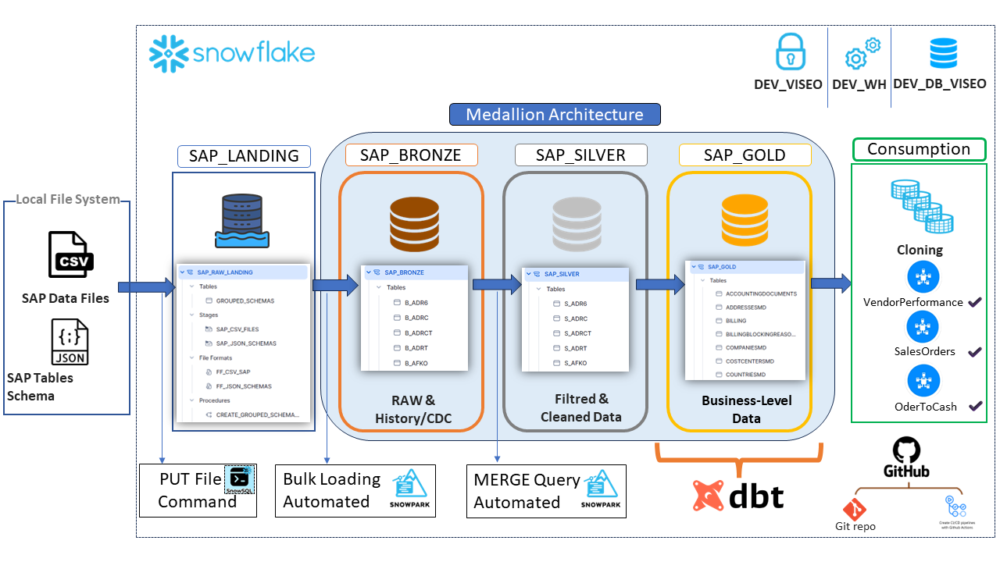

# SAP Data Acceleration Framework for Snowflake

## Introduction
The SAP Data Acceleration Framework with Snowflake ❄️ is designed to accelerate the time to value of SAP data by efficiently integrating it into Snowflake. This framework facilitates the seamless migration and transformation of SAP data, making it readily accessible for advanced analytics and BI activities. By leveraging a Medallion architecture, this proof of concept (POC) not only enhances the speed but also the flexibility of data handling, catering to diverse analytical needs.

## Features
Key features of the SAP Data Acceleration Framework include:
- **Automated Data Integration**: Uses The PUT File Command to upload files from local file System to Snowflake managed internal stages,....
- **File Format Optimization for Bulk Loading**: Custom file formats and staging techniques ensure efficient data loading from SAP Data files.
- **Medallion Architecture Implementation**: Structured data transformation across three layers—Bronze, Silver, and Gold—optimizing for different stages of data refinement and usage.
- **Snowpark for Data Processing**: Utilizes Snowpark Python scripts to manipulate and process data directly within Snowflake, leveraging native functions for enhanced performance and scalability.
- **Stored Procedures for Data Aggregation**: Aggregates multiple schema tables into a single comprehensive table, facilitating easier management and accessibility.
- **Automated Table Structure Creation**: Dynamically creates SAP table structures in Snowflake using metadata from SAP JSON schemas.

## Architecture
The architecture of the framework is built around Snowflake's powerful cloud data platform capabilities. The Medallion architecture facilitates a multi-layered transformation process:

1. **SAP_LANDING**: Raw data ingestion into `SAP_RAW_LANDING` using automated scripts.
2. **Silver Layer**: Data transformation and cleansing using an automated MERGE Query to prepare for analytics. See dev_poc_sap/POC_SAP_BRONZE/README.MD for more info's
3. **Gold Layer**: Aggregated and summarized data optimized for business intelligence.

## Getting Started
To get started with the SAP Data Acceleration Framework, follow these setup instructions. This will guide you through obtaining and configuring the necessary components to begin developing and testing within your own environment.

### Prerequisites
- **Snowflake Account**: Access to a Snowflake environment.

### Setup Instructions
1. **Stage SAP CSV Files**: Load your SAP CSV files into the `SAP_RAW_LANDING` schema using the custom file format.
2. **Run Snowpark Scripts**: Execute the provided Snowpark Python scripts to process data and create structured tables from JSON schemas.

### Additional Resources
- **SQL Scripts**: Located in the repository, these scripts help in setting up data pipelines and creating aggregated tables.
- **Snowpark Python Scripts**: Scripts for data processing and automation tasks are included to facilitate easy integration and manipulation of SAP data within Snowflake.
