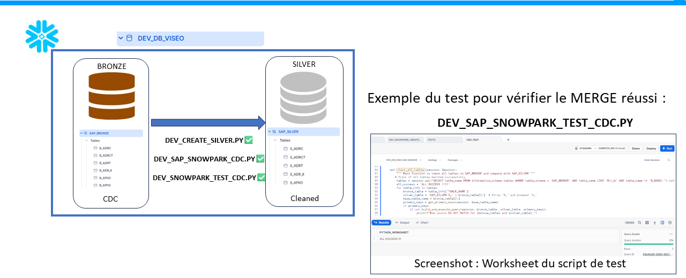

# Bronze To Silver - Documentation

## Overview

This folder contains the scripts that handle the process of bulk loading data from the `SAP_RAW_LANDING` schema to the `SAP_BRONZE` schema in Snowflake. The process involves several steps, including the use of internal named stages, file formats, and Snowpark Python scripts for automated data loading.

The following illustration provides a high-level overview of the steps involved:

## Contents