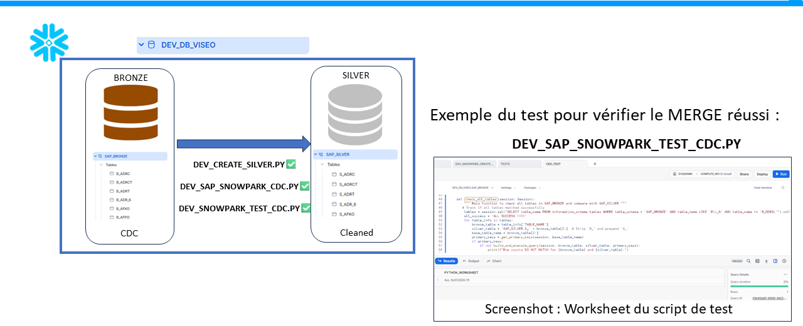

# Bronze To Silver - Documentation

## Overview

This folder contains the scripts that handle the process of transforming data from the `SAP_BRONZE` schema to the `SAP_SILVER` schema in Snowflake. The process involves several steps, including creating table structures, transforming data, and ensuring data integrity using Snowpark Python, Git integration, stored procedures, and Snowflake tasks.

The following illustration provides a high-level overview of the steps involved:

## Contents

### 1. Scripts

- **DEV_CREATE_SILVER.PY**
  - Purpose: This script creates the necessary tables in the `SAP_SILVER` schema.

- **DEV_SAP_SNOWPARK_CDC.PY**
  - Purpose: This script automates the process of Change Data Capture (CDC) from the `SAP_BRONZE` schema to the `SAP_SILVER` schema using Snowpark Python.

- **DEV_SAP_SNOWPARK_TEST_CDC.py** 
  - Purpose: This Snowpark Python script validates the CDC process between the SAP_BRONZE (source) and SAP_SILVER (target) schemas by comparing the row counts of tables, ensuring data integrity and consistency.
  
-  **DEV_ORCHESTRATE_WORKFLOW.PY**
   - Purpose: This script checks whether the `SAP_SILVER` tables exist and either creates them if they do not exist or proceeds to transform and merge data from `SAP_BRONZE` to `SAP_SILVER` using the respective stored procedures.
  
### 2. Stored Procedures

- **DEV_CREATE_SILVER_SP.SQL**
  - Purpose: Stored procedure for creating tables in the `SAP_SILVER` schema.

- **DEV_SAP_MERGE.SQL**
  - Purpose: Stored procedure for transforming and merging data from the `SAP_BRONZE` schema to the `SAP_SILVER` schema.

### 3. Tasks

- **DEV_CREATE_SILVER_TASK.SQL**
  - Purpose: Task to create the `SAP_SILVER` tables using the `DEV_CREATE_SILVER_SP` stored procedure.

- **DEV_TRANSFORM_TASK.SQL**
  - Purpose: Task to transform and merge data into the `SAP_SILVER` tables using the `DEV_SAP_MERGE` stored procedure.

### Process Overview

1. **Creating Silver Tables**: Tables in the `SAP_SILVER` schema are created using the `DEV_CREATE_SILVER.PY` script and the `DEV_CREATE_SILVER_SP` stored procedure.
2. **Transforming Data**: Data from the `SAP_BRONZE` schema is transformed and merged into the `SAP_SILVER` schema using the `DEV_SAP_SNOWPARK_CDC.PY` script and the `DEV_SAP_MERGE` stored procedure.
3. **Automating the Workflow**: The entire process is orchestrated through Snowflake Tasks which schedule and execute the stored procedures.

## Detailed Steps