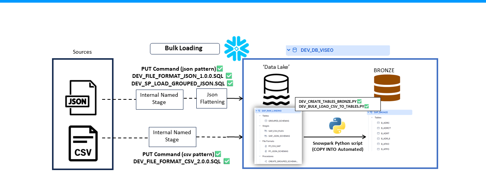

# Landing To Bronze - Documentation

## Overview

This folder contains the scripts that handle the process of bulk loading data from the `SAP_RAW_LANDING` schema to the `SAP_BRONZE` schema in Snowflake. The process involves several steps, including the use of internal named stages, file formats, and Snowpark Python scripts for automated data loading.

The following illustration provides a high-level overview of the steps involved:



## Contents

### 1. Scripts

- **DEV_CREATE_TABLES_BRONZE.PY**
  - Purpose: This script creates the necessary tables in the `SAP_BRONZE` schema.

- **DEV_BULK_LOAD_CSV_TO_TABLES.PY**
  - Purpose: This script automates the process of loading CSV data from the `SAP_RAW_LANDING` schema into the corresponding tables in the `SAP_BRONZE` schema using Snowpark Python.

### 2. Internal Named Stages

- **DEV_DB_VISEO.SAP_RAW_LANDING.SAP_CSV_FILES**
  - Purpose: Stage for storing CSV files to be loaded.

- **DEV_DB_VISEO.SAP_RAW_LANDING.SAP_JSON_FILES**
  - Purpose: Stage for storing JSON files to be loaded.

### 3. File Formats

- **DEV_FILE_FORMAT_CSV_2_0_0.SQL**
  - Purpose: Defines the file format for CSV files.

- **DEV_FILE_FORMAT_JSON_1_0_0.SQL**
  - Purpose: Defines the file format for JSON files.

### 4. Stored Procedures

- **DEV_SP_LOAD_GROUPED_JSON.SQL**
  - Purpose: Stored procedure for loading and flattening JSON data.

### Process Overview

1. **Source Files**: Data is sourced from CSV and JSON files.
2. **PUT Commands**: Files are uploaded to internal named stages using PUT commands.
3. **File Formats**: Files are read using predefined file formats.
4. **Snowpark Python Scripts**: Data is loaded into `SAP_BRONZE` tables through automated Snowpark Python scripts.

## Detailed Steps

### 1. Uploading Files to Stages

Use the following commands to upload CSV and JSON files to the respective stages using **SnowSQL** :

```sql
-- Upload CSV file to stage
PUT file://path_to_csv_files @DEV_DB_VISEO.SAP_RAW_LANDING.SAP_CSV_FILES;

-- Upload JSON file to stage
PUT file://path_to_json_files @DEV_DB_VISEO.SAP_RAW_LANDING.SAP_JSON_FILES;
